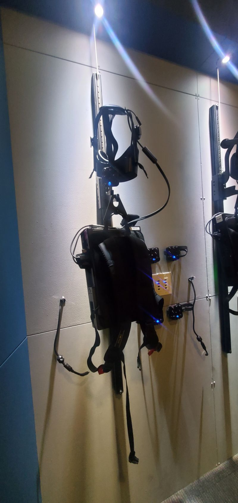

# ASU Dreamscape Tour

- March 19th, 2pm
- ASU Tempe: Second floor of the Creative Commons Building

## Summary 

The Technology Education Collaborative would like to invite you to join us on a tour of the [ASU Dreamscape Learning Lab](https://dreamscapelearn.asu.edu/). This virtual reality-based STEM curriculum has proven, long-term outcomes for students and as technology advocates and educators it's worthwhile to explore this impressive program. Here's a [video sneak peek](https://www.youtube.com/watch?v=khfFGra-qOk) of what to expect.

I've requested that the non-interactive components include a deeper dive into student outcomes and results. That presentation will be one part of the experience; the rest will be hands-on experiences with the VR labs and one full-body immersive experience. Wear comfortable shoes and clothes.

## PARKING 
There is an outdoor lot just east of Dreamscape.  The closest, larger lot will be the Tyler parking lot on McAllister and University.  You can get your parking validated by the Dreamscape lab.

## HOSTS
[Technology Education Collaborative](http://techedcollab.org/) Trips and events like this are made possible through donations, so please donate if you want to join us on more like these in the future. 

Feel free to reach out with any questions.

## Event Images

 
 
 