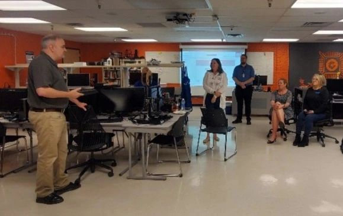
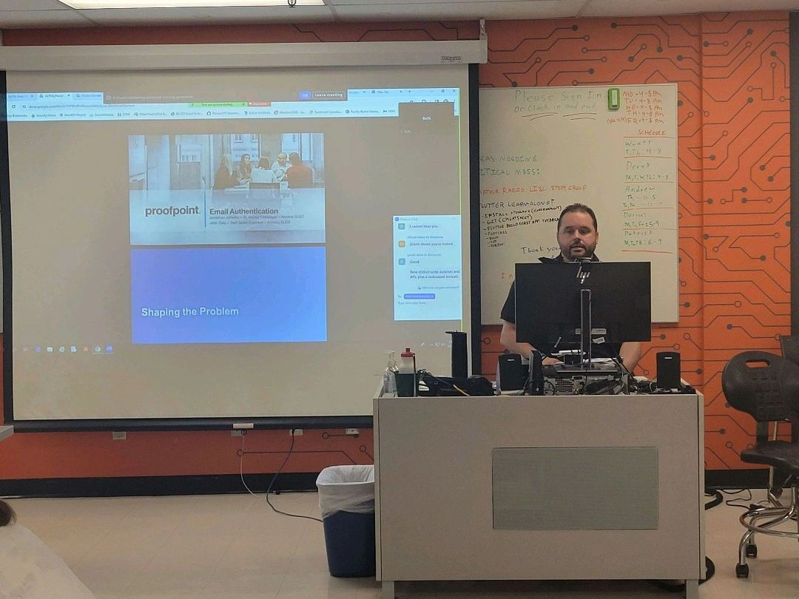
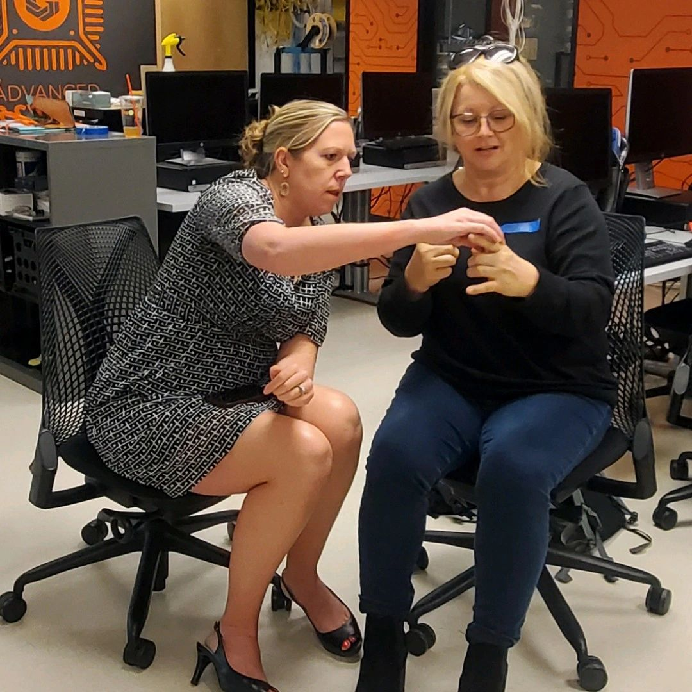

# AzTEA (ISTE/COSN Arizona) & Arizona Department of Education Tech Town Hall

- March 28th, 12 p.m.
- Advanced Cyber Systems Lab at Gateway Community College

## Summary

We had so much fun hosting AzTEA (ISTE/COSN Arizona) and ADE Technology Town Hall yesterday! 

🔓 In addition to touring the Advanced Cyber Systems Lab at GateWay Community College , TEC set up a micro-lock picking "village" in the ACSL that was a big hit. 

🏫 The activity was in keeping with the event's theme, which heavily focused on cybersecurity tools, practices and current issues in education technology. 

👩‍💻 Other topics included email authentication options, incident response, and tech asssessments. 

🔐 When CISOs and education IT professionals are in the same room learning from each other we can all sleep better at night. 

TEC so enjoyed hosting this event and looks forward to future collaboration opportunities with AzTEA (ISTE/COSN Arizona) in the future!

## Parking Map

## Event Images

 
 
 