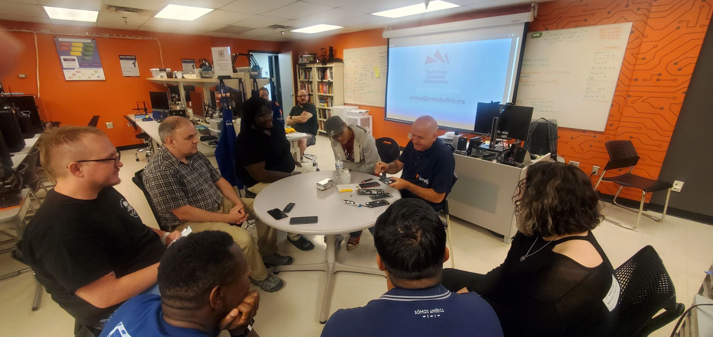

# Right to Repair Workshop

- May 23rd, 7pm
- Advanced Cyber Systems Lab at Gateway Community College

## Summary

TEC invites you to our May Right to Repair Workshop on Thursday, May 23, at 7 p.m. for a great hands-on introduction to your technology.

This FREE hour-and-a-half workshop is at the GateWay Community College Washington Campus in the Advanced Cyber Systems Lab (ACSL). See below for detailed location and parking information.

## Parking Map

## Event Images

 

  